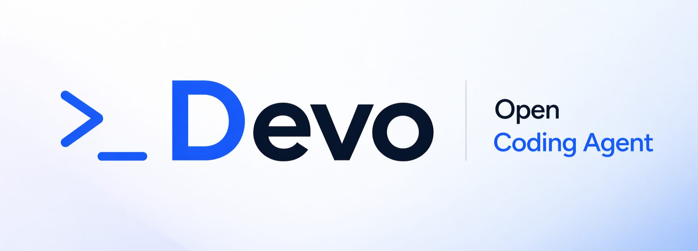
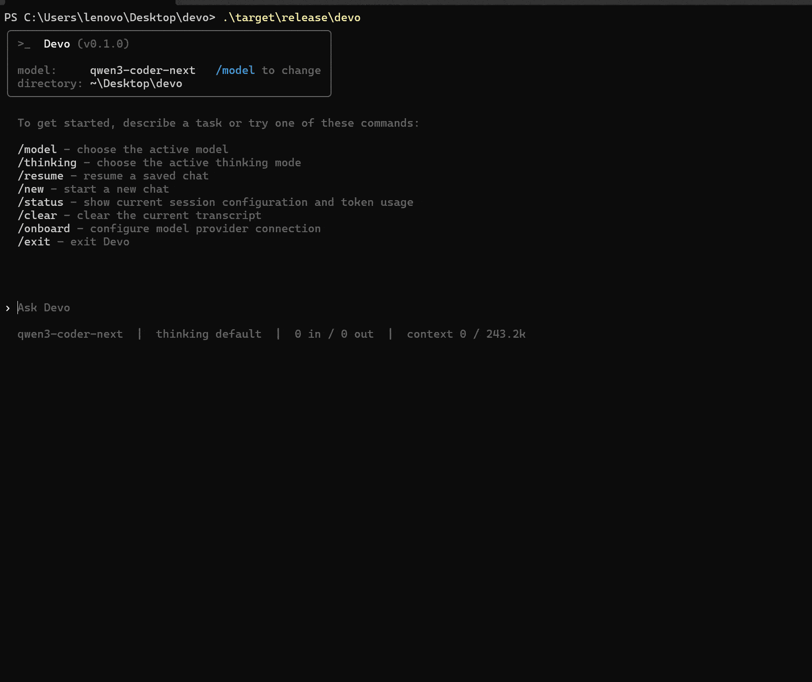

<div align="center">

**Un agent de programmation open source, extrêmement rapide, sécurisé et indépendant des fournisseurs de modèles.**

🚧Projet en phase initiale en développement actif — pas encore prêt pour la production.
⭐ Suivez-nous en ajoutant une étoile

[](https://github.com/)
[](https://www.rust-lang.org/)
[](https://docs.anthropic.com/en/docs/claude-code)
[](./LICENSE)
[](https://github.com/)

[English](./README.md) | [简体中文](./README.zh-CN.md) | [繁體中文](./README.zh-TW.md) | [日本語](./README.ja.md) | [한국어](./README.ko.md) | [Español](./README.es.md) | [Français](./README.fr.md) | [Português do Brasil](./README.pt-BR.md) | [Deutsch](./README.de.md) | [Русский](./README.ru.md) | [Türkçe](./README.tr.md)



</div>

---

## 📖 Table des matières

- [Démarrage rapide](#-démarrage-rapide)
- [Questions fréquentes](#-questions-fréquentes)
- [Contribuer](#-contribuer)
- [Licence](#-licence)

## 🚀 Démarrage rapide

<!-- ### Installation -->

Pas encore de version stable — vous pouvez construire le projet depuis les sources en suivant les instructions ci-dessous.

### Construction

```bash
git clone https://github.com/7df-lab/devo && cd devo
cargo build --release

# linux / macos
./target/release/devo onboard

# windows
.\target\release\devo onboard
```

> [!TIP]
> Assurez-vous d'avoir Rust installé, version 1.75+ recommandée (via https://rustup.rs/).

## Questions fréquentes

### En quoi est-ce différent de Claude Code ?

C'est très similaire à Claude Code en termes de capacités. Voici les principales différences :

- 100% open source
- Non couplé à un fournisseur spécifique. Devo peut être utilisé avec Claude, OpenAI, z.ai, Qwen, Deepseek, ou même des modèles locaux. Au fur et à mesure que les modèles évoluent, les écarts entre eux se réduiront et les prix baisseront, donc être indépendant des fournisseurs est important.
- La prise en charge TUI est déjà implémentée.
- Construit avec une architecture client/serveur. Par exemple, le noyau peut s'exécuter localement sur votre machine tout en étant contrôlé à distance (par exemple, depuis une application mobile), le TUI n'étant qu'un des nombreux clients possibles.


## 🤝 Contribuer

Les contributions sont les bienvenues ! Ce projet est en phase de conception initiale, et il y a de nombreuses façons d'aider :

- **Retour sur l'architecture** — Examinez la conception des crates et suggérez des améliorations
- **Discussions RFC** — Proposez de nouvelles idées via les issues
- **Documentation** — Aidez à améliorer ou traduire la documentation
- **Implémentation** — Prenez en charge l'implémentation des crates une fois les conceptions stabilisées

N'hésitez pas à ouvrir une issue ou à soumettre une pull request.

## 📄 Licence

Ce projet est sous licence [MIT License](./LICENSE).

---

**Si vous trouvez ce projet utile, pensez à lui donner un ⭐**
